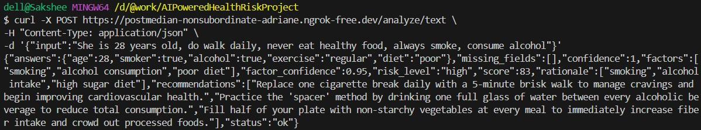
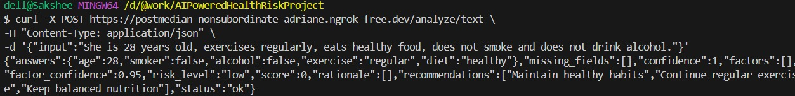
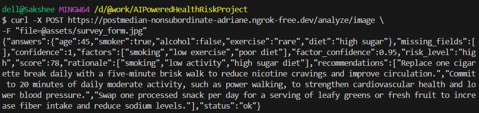
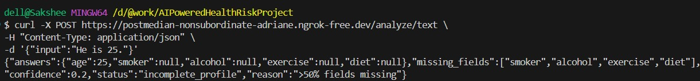

<h1>🩺 AI-Powered Health Risk Profiler</h1>
An AI-powered backend service that analyzes lifestyle survey responses (text or scanned images) and generates a structured health risk profile including risk factors, risk level, and actionable recommendations.

This project demonstrates OCR processing, semantic normalization, risk scoring, guardrails for incomplete data, and AI-driven recommendation generation.

🚀 Features

📄 Accepts text and scanned image survey inputs

🔍 OCR + AI semantic normalization

⚠️ Guardrails for incomplete profiles

📊 Risk scoring with rationale

🧠 AI-generated actionable recommendations

🌐 Public API exposure using ngrok

📦 Modular, industry-standard backend architecture

🏗 Architecture

src/
 ├── controllers/
 ├── routes/
 ├── services/
 ├── pipeline/
 ├── utils/
 ├── server.js
assets/
 ├── survey_form.jpg
.env
package.json

Pipeline Flow

Input → OCR/Text Parsing → Normalization → Factor Extraction
      → Confidence & Guardrails → Risk Scoring → Recommendations

⚙️ Setup Instructions
1️⃣ Clone repository
git clone <your-github-repo-url>
cd AIPoweredHealthRiskProject

2️⃣ Install dependencies
npm install

3️⃣ Create .env file
GEMINI_API_KEY=your_api_key_here

4️⃣ Start server
npm start

Server runs at:

http://localhost:3000

5️⃣ Start ngrok
ngrok http 3000

Copy the generated HTTPS URL.

🔗 Public API (Demo)

Example:

https://postmedian-nonsubordinate-adriane.ngrok-free.dev

⚠️ Note: ngrok URLs are temporary. Refer to screen recording for live demo.

🧪 Test Case 1 — High Risk
{
  "input": "He is 45 years old, smokes daily, eats sugary food, never exercises and drinks alcohol regularly."
}

curl -X POST https://YOUR_NGROK_URL/analyze/text \
-H "Content-Type: application/json" \
-d '{"input":"He is 45 years old, smokes daily, eats sugary food, never exercises and drinks alcohol regularly."}'

🧪 Test Case 2 — Moderate Risk
{
  "input": "She is 30, does not smoke, eats balanced meals, but rarely exercises."
}

curl -X POST https://YOUR_NGROK_URL/analyze/text \
-H "Content-Type: application/json" \
-d '{"input":"She is 30, does not smoke, eats balanced meals, but rarely exercises."}'

🧪 Test Case 3 — Low Risk (Healthy)
{
  "input": "She is 28 years old, exercises regularly, eats healthy food, does not smoke and does not drink alcohol."
}

curl -X POST https://YOUR_NGROK_URL/analyze/text \
-H "Content-Type: application/json" \
-d '{"input":"She is 28 years old, exercises regularly, eats healthy food, does not smoke and does not drink alcohol."}'

🧪 Test Case 4 — Guardrail (Incomplete Profile)
{
  "input": "He is 25."
}

curl -X POST https://YOUR_NGROK_URL/analyze/text \
-H "Content-Type: application/json" \
-d '{"input":"He is 25."}'

POST /analyze/image

Curl
curl -X POST https://YOUR_NGROK_URL/analyze/image \
-F "file=@assets/survey_form.jpg"

📤 Sample Output
{
  "answers": {
    "age": 30,
    "smoker": false,
    "alcohol": null,
    "exercise": "rare",
    "diet": "balanced"
  },
  "missing_fields": ["alcohol"],
  "confidence": 0.8,
  "factors": ["low exercise"],
  "factor_confidence": 0.76,
  "risk_level": "low",
  "score": 20,
  "rationale": ["low activity"],
  "recommendations": [
    "Take short daily walks",
    "Use stairs when possible",
    "Stretch every hour"
  ],
  "status": "ok"
}

🛑 Guardrail Example

Input

He is 25.

Output

{
  "status": "incomplete_profile",
  "reason": ">50% fields missing"
}

🧪 Test Scenarios Covered
Case	Description
High Risk	Smoker + poor diet + no exercise
Moderate Risk	Partial healthy
Low Risk	Healthy lifestyle
Incomplete	Guardrail triggered
OCR	Image survey form
🧠 AI Usage

AI is used for:

OCR + semantic normalization

Natural language understanding

Recommendation generation

Validation and chaining

All outputs remain non-diagnostic.

## 📸 API Screenshots

### High Risk Text Input

---

### Low Risk Text Input

---

### Image OCR Input

---

### Guardrail Trigger Case

## 🎥 Demo Videos

- Text API Demo Video link:https://drive.google.com/file/d/15zo8U9xt9DwT7nFi1ZdJ3znsv0hA98qO/view?usp=sharing
- OCR API Demo Video link: https://drive.google.com/file/d/1BGD_KtAw-RU2125McJTp_Fdh_6WwaUwF/view?usp=sharing

A short screen recording demonstrates:

Server running

ngrok public URL

Text API test

Image OCR test

JSON output

🧩 Error Handling

Missing input validation

OCR fallback checks

Guardrail enforcement

AI response validation

📈 Future Improvements

Database persistence

User history tracking

Dashboard UI

Batch processing

Multilingual OCR

👩‍💻 Author

Sakshee Shukla
SDE Intern Assignment – Grow Insurance
